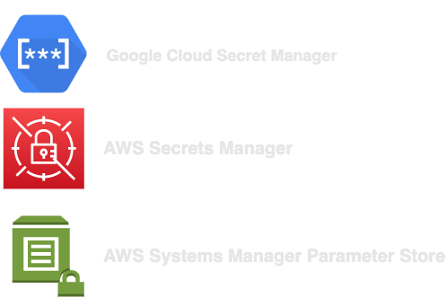

## Kubernetes and Secrets Management in the Cloud

<!-- _footer:  -->
<!-- _paginate: false -->

 _Alexei Ledenev_

github.com/doitintl/kube-secrets-init

---

### Secrets are EVERYTHERE

---

## Challenges

- Fine-grained Access Control
- Lifecycle Management (rotate, revoke, versioning)
- Auditing (who, when, how)
- Usage monitoring
- Strongly Encrypted Storage
- Integration (API, cross-service)
- Compliance with Standards (FedRAMP, ISO, HIPAA)

---

## Kubernetes Secrets

```yaml
apiVersion: v1
kind: Secret
metadata:
  name: db-credentials
type: Opaque
data:
  password: cXVpY2suZm94LjUzMTI=
  user: ZGJ1c2Vy
```

---

## What are Kubernetes Secrets

1. Namespaced K8s objects
1. Can be mounted as data volumes or ENV variables
1. Secret data is stored in `tmpfs` in nodes
1. API server stores secrets as **plain text** (`base64` encoded) in **etcd**
1. A per-secret size limit of 1MB

---
## Protect with RBAC

1.jpg)

---

```yaml
apiVersion: rbac.authorization.k8s.io/v1
kind: Role
metadata:
  name: secret-reader
  namespace: app
rules:
  - apiGroups: ["*"]
    resources: ["secrets"]
    resourceNames: ["api-key", "ssh-key"]
    verbs: ["get"]
```

---

## Encrypt Secrets at Rest

**`EncryptionConfiguration`**


---

### Envelope encryption GCP/AWS

- Not enforced by default
- GKE application-layer secrets encryption
    - 31 Oct 2019
    - new/existing GKE clusters (1.11+)
- EKS envelop encryption
    - 5 Mar 2020 (new clusters)
    - 1 Mar 2021 (existing clusters 1.13+)
- Cost, the same (more or less)
    - $1/key/month + $0.03/10,000req

---

## Still ...

- no auditing
- no lifecycle management
- no integration with external services
- no compliance support

---

## Cloud Secrets Managers



---

## Common Capabilities

- Auditing
- Lifecycle Management (rotation, retention)
- Versioning
- Strong Encryption
- Fine-grained access control with IAM Policies
- API, SDK, CLI, UI access
- No built-in integration with GKE/EKS :disappointed:

---

## Kubernetes Integration (future)

- Promissing Kubernetes SIG: **Secret Store CSI Driver**
- Integrates secrets stores via a CSI volume
- Providers: Google, Azure, Vault ... no AWS yet
- :eyes: secrets-store-csi-driver.sigs.k8s.io

---

## Working solutions today

- Cloud SDK, API
- Open Source Projects
    - `external-secrets/kubernetes-external-secrets` (MIT)
    - `GoogleCloudPlatform/berglas` (APL 2.0)
    - `aws-samples/aws-secret-sidecar-injector` :warning:
    - `doitintl/secrets-init` (APL 2.0)
    - **`doitintl/kube-secrets-init`** (APL 2.0)

---

## DoiT Kube-Secrets-Init

- Intercepts K8s API after request is authenticated and authorized, but before object is persistent
- Injects `secret-init` `initContainer`


---


---

## Demo
